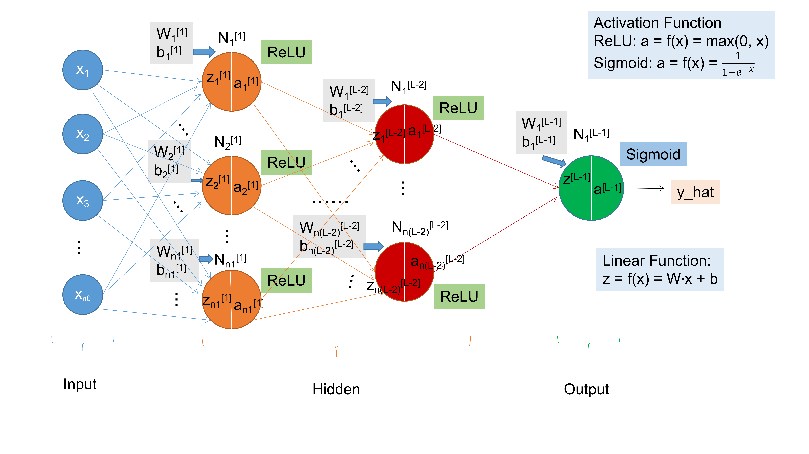

# NeuralNetworkLearning

A implementation of a simple neural network. The main content is in `dnn_utils.py`. Inside the `nn.py` is an instance to train a `con vs non-cat` classfier.

## 1.What do I implement inside `dnn_utils.py `  ?

- A deeplearning model contained **L** layers.

  

